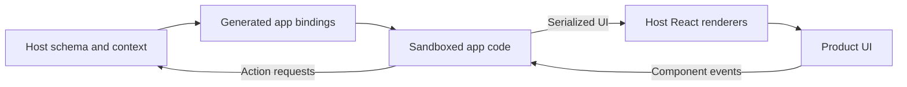

TailorKit lets your product host runtime apps in specific parts of the UI while
keeping control of the page, data, and platform behavior.

## The model

A TailorKit integration has two sides:

- **Host product:** your product owns the page, routes, auth, data,
  permissions, and final rendering.
- **App code:** independently built code runs in a sandbox and describes the
  app UI it wants to show.

TailorKit builds a contract between your host app and custom apps. That
contract defines which UI components are available, which actions apps can
perform, and which theme tokens they can use to match your product.

## What the host owns

The host is the source of truth. It chooses the active view, passes view
context, renders approved components, and handles sensitive work through host
actions.

For example, the host can say: "this part of the user route is the `/user`
view, and here is the current user context." Read [Views](/docs/views)
for the full pattern.

## What apps own

Apps are built separately from the host. They import generated bindings from the
schema, implement one or more views, and describe UI using host-approved
components.

Read [Writing apps](/docs/writing-apps) and [Components](/docs/components) for
the app-side and host-side details.

## Sandbox and security

App code runs in a hidden, opaque-origin iframe sandbox. It receives view
context, renders approved declarative elements inside that iframe, and relays
the validated UI description and events to the host. The host renders the real
UI and keeps direct access to routing, data, secrets, and browser APIs.

### Isolated runtime

TailorKit treats app code as untrusted by default. Apps run directly inside a
sandboxed opaque-origin iframe and can only render through the views,
components, props, callbacks, children, and tokens your host exposes. The host
receives only the validated declarative UI protocol; app DOM never becomes part
of the host document.

The iframe allows scripts but not same-origin access. Its content security
policy blocks network connections, images, styles, nested frames, and form
submissions from the sandbox document. The host fetches app code before passing
it across the sandbox boundary.

### Event boundary

Events move through TailorKit. A user clicks a host-rendered component, the
callback is forwarded to the app sandbox, and the app can update its rendered
output.

The host keeps control of sensitive work such as loading data, checking
permissions, changing pages, and rendering the final interface. App events are
forwarded through TailorKit, so the host can validate payloads and decide which
callbacks or actions are allowed.

### Narrow capabilities

That lets you grant narrow capabilities without opening the whole browser
environment. For example, you can expose a host-owned copy-to-clipboard action
while still preventing app code from reading local storage, cookies, or other
page-level state directly.

The sandbox is one layer of the security model, not a substitute for narrow
schemas, authorization, and output validation. For the complete checklist,
read [Deploying to production](/docs/deploying-to-production).
