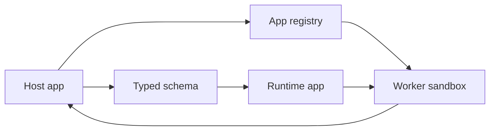

TailorKit lets your product load small runtime apps without giving those apps
control of the whole page. Your product stays the host. The app supplies UI for
specific places inside it.

## The Model

A TailorKit integration has four parts:

- **Host app:** your React product. It owns routes, auth, data loading,
  permissions, and the final UI.
- **Schema:** the contract that says which screens, components, props,
  callbacks, slots, and tokens apps can use.
- **Runtime app:** an independently built app bundle that targets the schema.
- **Sandbox:** the worker boundary that runs app code away from the host page.

The host decides where apps can appear. Apps can only render the screens and
components the host exposes.



## What The Host Owns

The host is the source of truth. It chooses the active screen, passes screen
context, renders approved components, and handles sensitive work through host
callbacks.

For example, the host can say: "this part of the user route is the `/user`
screen, and here is the current user context." Read [Screens](/docs/screens)
for the full pattern.

## What Apps Own

Apps are built separately from the host. They import generated bindings from the
schema, implement one or more screens, and describe UI using host-approved
components.

An app can ask for a `Button`, but the host decides which real React component
renders that button. Read [Writing apps](/docs/writing-apps) and
[Components](/docs/components) for the app-side and host-side details.

## How Apps Load

At runtime, the host reads the app registry. Each registry entry points to an
app client bundle and metadata.

```tsx
const { apps } = tailor.useApps();
```

The host can render one app or many apps for the current screen:

```tsx
return apps.map((app) => <tailor.Screen key={app.id} app={app} />);
```

In development, app bundles usually come from the TailorKit preview server. In
production, they come from wherever you publish your app registry and bundles.
Read [Installation](/docs/installation) for host setup.

## What The Sandbox Does

App code runs in a worker sandbox. It receives screen context, returns a
description of the UI, and responds to events. The host renders the real UI and
keeps direct access to routing, data, secrets, and browser APIs.

Events move through TailorKit. A user clicks a host-rendered component, the
callback is forwarded to the app sandbox, and the app can update its rendered
output.

For production guidance, read
[Deploying to production](/docs/deploying-to-production).

## Why This Works

TailorKit keeps the platform boundary small:

- Product state stays in the host.
- Extension code ships independently as runtime apps.
- UI stays consistent through host components and theme tokens.
- The schema gives both sides a typed contract.
- The sandbox limits what app code can touch directly.

The result is an extension model where customers can add apps without those
apps becoming part of your core product codebase.

## Next

- Start with [Installation](/docs/installation) to wire TailorKit into a host.
- Use [Styling apps](/docs/styling-apps) to expose safe theme tokens.
- Use [Actions](/docs/actions) when apps need to trigger host-owned work.
- Use [Client](/docs/client) when implementing an app entry point.
