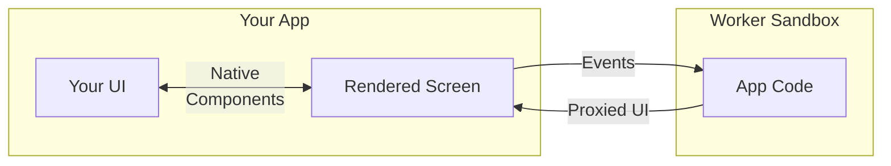

TailorKit apps are sandboxed extensions that plug into screens your product
already owns. The host keeps control of routing, data, and native components.

## Overview

### The Short Version

- The host app decides which screen is active.
- The host app provides the screen context.
- The TailorKit app renders UI for that screen.
- The sandbox keeps the app code contained.
- The host renders the final UI with approved native components.



### Host And App

Every TailorKit integration has two sides.

- The **host** owns routing, auth, data loading, layout, and native components.
- The **app** is built separately, loaded at runtime, and rendered inside a
  screen chosen by the host.

### App Registry

The host also asks the TailorKit registry which apps are available:

```tsx
const { apps, error, status } = tailor.useApps();
```

Each registry item includes the app id, client URL, and any metadata the host
needs.

## Components

Components let apps feel native without direct access to product internals.

### Host Renderers

The host defines the real component renderers:

```tsx
export const tailor = tailorKit(schema, {
  baseUrl: "http://127.0.0.1:4175",
  components: {
    Button: ({ props, slots }) => (
      <button type="button" onClick={props.onClick}>
        {slots.default}
      </button>
    ),
  },
});
```

### App Bindings

The app imports generated bindings for those components:

```tsx
import { h } from "preact";
import { Button } from "#tailorkit";

export function SaveButton() {
  return h(
    Button,
    {
      onClick: () => {},
      variant: "primary",
    },
    "Save changes",
  );
}
```

The app asks for `Button`; the host decides what `Button` actually means.

<details>
  <summary>The technical stuff</summary>

Components are declared in your TailorKit schema. Their fields, callbacks, and
slots become generated types for app authors. The sandbox sends component
requests to the host as a proxied UI tree, and the host renders them with the
React components you configured.

</details>

## Screens

### Host Match

The host wraps part of a route in `ScreenMatch` to tell TailorKit which screen
is active.

```tsx
<tailor.ScreenMatch
  pattern="/users/:userId"
  params={{ userId }}
  screen="/user"
  context={{ userId, user }}
>
  <UserPage />
</tailor.ScreenMatch>
```

TailorKit does not inspect the browser URL and guess. Your router already knows
where the user is, so the host passes that knowledge in directly.

### App Screen

The app implements the same screen key using generated screen props:

```tsx
import { h } from "preact";
import { Button } from "#tailorkit";
import type { ScreenProps } from "#tailorkit";

type UserScreenProps = ScreenProps<"/user">;

export default function UserScreen({ context }: UserScreenProps) {
  return h(
    Button,
    {
      onClick: () => {},
      variant: "primary",
    },
    `Open ${context.user.name}`,
  );
}
```

Screens connect product context to app UI. The host provides the `/user`
context; the app renders the `/user` screen.

<details>
  <summary>The technical stuff</summary>

`pattern` and `params` identify the route match. `screen` must be one of the
screens defined in your TailorKit schema. `context` is typed from that screen's
schema, so missing fields or invalid screen names fail during development
instead of turning into mystery runtime behavior.

</details>

## Sandboxing

### Running The App

When the host renders a TailorKit app, the app code runs inside a worker
sandbox. That code can receive screen context and respond to events, but it does
not get direct ownership of the host page.

```tsx
{
  apps.map((app) => <tailor.Screen key={app.id} app={app} />);
}
```

### Message Passing

App code can describe UI and handle callbacks, while the host controls the page,
components, and route data.

### App Bundles

In local development, sandboxed app clients usually come from the TailorKit
preview server. In production, they can come from wherever you publish app
metadata and client bundles.

<details>
  <summary>The technical stuff</summary>

App screens are compiled into a runtime client bundle. The sandbox executes
that bundle and sends a proxied UI description back to the host. Events travel
the other way: a user clicks a host-rendered component, TailorKit forwards the
callback to the sandbox, and the app can update its rendered output.

</details>

## Why This Shape Works

TailorKit keeps the busy parts in the places that already understand them:

- Routes stay in the host.
- Product data stays in the host.
- Design system components stay in the host.
- Extension code ships as runtime apps.
- App rendering happens through a typed schema contract.

The result is a small boundary between a product and the apps extending it.
