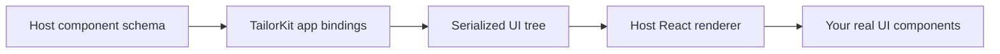

import { Callout } from "fumadocs-ui/components/callout";

Components are the UI building blocks that TailorKit apps are allowed to use.
An app does not import your React components directly and it does not render DOM
inside your page. Instead, it renders named TailorKit components from the
contract your host product exposes.

The host owns the real component implementation. TailorKit apps only see the
component name, its serializable fields, its callbacks, and its slots.



This keeps app UI consistent with your product while keeping the host in control
of what can be rendered.

## Define the component contract

A component definition has three parts:

- `fields`: serializable props the app can pass to the component.
- `callbacks`: functions the app can receive when host UI events happen.
- `slots`: named children areas the app can fill.

The TanStack Start example defines shared components in
`@examples/shared` and passes them to `createTailorKit`.

```ts title="examples/shared/src/index.ts"
import type { Component } from "tailorkit";
import { primitives } from "tailorkit/zod";
import { z } from "zod";

const Button = {
  fields: z.object({
    size: z.enum(["default", "sm", "lg", "icon", "icon-sm", "icon-lg"]).optional(),
    variant: z.enum(["default", "secondary", "ghost", "outline", "destructive"]).optional(),
  }),
  callbacks: {
    onClick: {},
  },
  slots: ["default"],
} as const satisfies Component;

const Input = {
  fields: z.object({
    value: z.string(),
  }),
  callbacks: {
    onValueChange: {
      input: z.object({ value: z.string() }),
    },
  },
  slots: ["default"],
} as const satisfies Component;

export const components = {
  ...primitives(primitiveTheme),
  Button,
  Input,
};
```

`as const satisfies Component` keeps the literal component shape available to
TypeScript while checking that the object is a valid TailorKit component.

## Fields

Fields are the serializable props an app can set. In the example above, apps can
pass `variant` and `size` to `Button`, but they cannot pass arbitrary React
props.

Fields use the same schema model as screens and actions. The example uses Zod
via `tailorkit/zod`, and TailorKit serializes the schema into JSON Schema for
the runtime contract.

```ts
const TabsTab = {
  fields: z.object({
    value: z.string(),
  }),
  slots: ["default"],
} as const satisfies Component;
```

Fields should describe stable product capabilities, not incidental React
implementation details. Prefer `variant: "secondary"` over exposing class names
or internal state that may change when you restyle the component.

## Callbacks

Callbacks are UI events that flow from the host-rendered component back to the
TailorKit app. They are not server actions and they are not trusted work. Use
callbacks for local interaction such as clicks, selected tab changes, and input
changes.

```ts
const Tabs = {
  fields: z.object({
    value: z.string(),
  }),
  callbacks: {
    onValueChange: {
      input: z.object({ value: z.string() }),
    },
  },
  slots: ["default"],
} as const satisfies Component;
```

A callback can define `input` and `output` schemas. The React renderer decides
when to call the callback and what payload to send.

```tsx title="examples/tanstack-start/src/lib/tailorkit-client.tsx"
Input: ({ props: { onValueChange, ...rest }, slots }) => (
  <Input onChange={(event) => onValueChange({ value: event.target.value })} {...rest}>
    {slots.default}
  </Input>
),
```

Use [Actions](/docs/actions) for trusted server-side work such as database
writes, permission checks, and external API calls.

## Slots

Slots define where child UI can be placed. Most simple components use a
`default` slot.

```ts
const TabsList = {
  slots: ["default"],
} as const satisfies Component;
```

On the host, the React renderer receives slots as React nodes.

```tsx
TabsList: ({ props, slots }) => <TabsList {...props}>{slots.default}</TabsList>,
```

Declare only the slots you intend apps to use. A component without `slots` is a
leaf component from the app's point of view.

## Register components on the server

Pass the component map to `createTailorKit`. This makes the component contract
available from the TailorKit API route.

```ts title="examples/tanstack-start/src/lib/tailorkit.ts"
import { actions, components, screens } from "@examples/shared";
import { createTailorKit } from "tailorkit";

export const tailorKit = createTailorKit({
  assetsBaseUrl: process.env.TAILORKIT_ASSETS_BASE_URL ?? "http://localhost:8333/tailorkit",
  projectKey: process.env.TAILORKIT_PROJECT_KEY,
  components,
  screens,
  actions,
});
```

The server exposes the serialized contract through the TailorKit handler. The
handler returns `schema.serialize()` from `/api/tailorkit/schema` and includes
the same schema in `/api/tailorkit/meta`.

```ts title="examples/tanstack-start/src/routes/api/tailorkit.$.ts"
import { getDemoUserFromRequest } from "@examples/shared";
import { tailorKit } from "#lib/tailorkit";
import { createFileRoute } from "@tanstack/react-router";

const handle = ({ request }: { request: Request }) =>
  tailorKit.handler(request, {
    authenticate: () => {
      const user = getDemoUserFromRequest(request);

      if (!user) {
        return null;
      }

      return {
        actionContext: { user },
        scopeId: user.id,
      };
    },
  });

export const Route = createFileRoute("/api/tailorkit/$")({
  server: {
    handlers: {
      GET: handle,
      POST: handle,
    },
  },
});
```

## Register renderers on the client

The client maps each server-defined component name to a real React renderer.
`createTailorKitClient<typeof tailorKit>()` uses the server schema type so
renderer props and slots are typed from your component definitions.

```tsx title="examples/tanstack-start/src/lib/tailorkit-client.tsx"
import type { tailorKit } from "./tailorkit";
import { primitiveTheme } from "@examples/shared";
import { primitives as reactPrimitives, createTailorKitClient } from "tailorkit/react";
import { Button } from "@tailorkit/ui/components/button";
import { Input } from "@tailorkit/ui/components/input";

export const tailorKitClient = createTailorKitClient<typeof tailorKit>({
  baseUrl:
    typeof window === "undefined"
      ? "http://localhost/api/tailorkit/"
      : new URL("/api/tailorkit/", window.location.origin),
  theme: primitiveTheme,
  components: {
    ...reactPrimitives,
    Button: ({ props, slots }) => <Button {...props}>{slots.default}</Button>,
    Input: ({ props: { onValueChange, ...rest }, slots }) => (
      <Input onChange={(event) => onValueChange({ value: event.target.value })} {...rest}>
        {slots.default}
      </Input>
    ),
  },
});
```

When a remote app renders `Button`, TailorKit looks up the registered host
renderer by name and renders the real `@tailorkit/ui` button. If a remote app
uses a component that is not registered, the host throws:
`TailorKit component "Name" is not registered.`

## Serialized schema reference

TailorKit serializes components into a stable runtime shape:

```ts
{
  version: 1,
  components: {
    Button: {
      fields: { /* JSON Schema */ },
      callbacks: {
        onClick: {
          input: undefined,
          output: undefined,
        },
      },
      slots: ["default"],
    },
  },
  screens: {},
  actions: {},
}
```

This schema is the contract between the host product, generated app bindings,
and deployed TailorKit apps. Changing it is a compatibility decision, not just a
local refactor.

<Callout title="Keep Components Stable">
  Renaming a component, removing a field, changing a field's type, removing a callback, or removing
  a slot can break existing apps. Add new optional fields, new callback payload fields, or new
  components when possible. When you need a breaking change, version the component name or
  coordinate the app update.
</Callout>

## Naming and compatibility

Component names are public API. TailorKit also derives DOM-style tag names from
them for remote rendering, so `TextArea` can be addressed as `tailorkit-text-area`
inside the runtime.

Use product-level names that can survive implementation changes:

- Good: `Button`, `CustomerCard`, `AssigneeSelect`.
- Risky: `NewButtonV2`, `RadixSelectTrigger`, `BluePill`.

Use fields for stable variants and behavior, callbacks for app-handled UI
events, slots for child composition, and actions for trusted server-side work.
