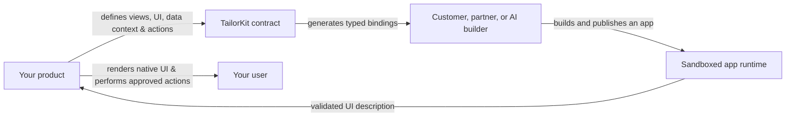

import { Card, Cards } from "fumadocs-ui/components/card";
import { BoxesIcon, CodeIcon, RocketIcon, ShieldCheckIcon, WandSparklesIcon } from "lucide-react";

TailorKit is an extension platform for SaaS products. It lets your customers,
partners, and AI builders create and install focused features inside the product
they already use, without handing third-party code your routes, data, or design
system.

You decide where extensions can appear, what they can render, what context they
receive, and which server-side actions they may request. Builders create the
experience within those boundaries. The result feels native to your product,
while you remain in control.

## Why TailorKit

Every SaaS eventually meets requests that are valuable but too specific to put
on the core roadmap: a bespoke approval flow, a team dashboard, an industry
workflow, or a connection to an internal process. Building every request
yourself does not scale. Letting arbitrary code into your app is not a safe
alternative.

TailorKit gives you a third option: make your product extensible by design.

| Without an extension platform                                  | With TailorKit                                                      |
| -------------------------------------------------------------- | ------------------------------------------------------------------- |
| Your team owns every custom feature request.                   | Customers, partners, and AI can build focused extensions.           |
| Third-party integrations need one-off, bespoke implementation. | Builders use one typed contract for your product.                   |
| Custom UI drifts from your brand and interaction patterns.     | Extensions render with the components and theme tokens you approve. |
| External code needs broad access to be useful.                 | Apps receive only the context and trusted actions you expose.       |

## How it works

TailorKit sits between your product and the people building on it. Your product
publishes a contract; apps use that contract to describe an experience; your
product renders the final UI.

### 1. Define the extension surface

In your product, define **views** and **slots**: the places where an app can
appear. Then choose the components, theme tokens, context fields, and actions
that apps may use. This schema is the public API of your ecosystem.

For example, a CRM could expose a customer sidebar slot, read-only customer
context, its own `Button` and `Card` components, and a validated `createTask`
action. An extension can create a useful customer workflow, but it cannot read
cookies, query your database directly, or navigate around your app unchecked.

### 2. Let builders work with your product, not around it

Builders turn your contract into local TypeScript bindings and use them to
build app views. They work with the same component vocabulary and data shapes
you define, whether the app was written by a developer, a partner team, or an
AI builder.

That means there is no blank canvas to integrate later. A new extension starts
with the guardrails that make it look and behave like part of your product.

### 3. Run extensions safely in production

TailorKit hosts and serves app code, then runs it in an opaque-origin iframe
sandbox. The app describes UI; your React application renders the real UI.
Events travel back through TailorKit, and trusted work is handled by the
server-side actions you provide.

Your product keeps ownership of authentication, authorization, routing, data,
secrets, and the final rendered interface. TailorKit keeps independent code on
a narrow, deliberate boundary.

## What you get

### An app ecosystem that still feels like your product

Apps use your approved components and theme tokens, so extensions inherit your
visual language instead of bringing a second design system into your product.
You control the surfaces where apps appear and the UI they are allowed to
compose.

### A path from an idea to a working feature

TailorKit is built for developer-authored apps and agentic builders alike. A
customer can describe the workflow they need; an AI builder can turn it into an
extension using the real components, context, and actions your product exposes.

### Security by capability, not trust

Treat app code as untrusted by default. Apps do not join your page's DOM or get
direct access to browser state, credentials, or your backend. Instead, you
grant narrow capabilities through typed context, validated components, and
explicit server actions.

### Hosted delivery without extension infrastructure

TailorKit handles app hosting and delivery through its global CDN. You do not
need to create a separate asset pipeline or deployment system for every app
your ecosystem produces.

## Who is TailorKit for?

TailorKit is for product teams building software that becomes more valuable
when customers can make it their own.

- **Product teams** can support long-tail workflows without turning each request into core-product work.
- **Platform and partner teams** can give third parties a supported, consistent way to build integrations and extensions.
- **AI-forward teams** can let users turn a plain-language need into a constrained, product-native feature.
- **App builders** can create useful product experiences without reverse-engineering an unfamiliar codebase or design system.

## What TailorKit is, and is not

TailorKit is a framework and hosted platform for **in-product extensions**. It
is not a low-code page builder, an unrestricted script tag, or a replacement
for your core application. Your team still owns the product model, security
policy, permissions, and the capabilities that extensions can use.

That division is intentional: your users gain flexibility, while your product
keeps its standards and its control.

## Start with the path that matches your role

<Cards>
  <Card
    href="/docs/integrate/installation"
    icon={<RocketIcon />}
    title="Embed TailorKit in your product"
  >
    Install the SDK, publish your first contract, and render an app surface.
  </Card>
  <Card
    href="/docs/integrate/how-apps-work"
    icon={<ShieldCheckIcon />}
    title="Understand the runtime model"
  >
    See exactly what the host owns, what apps own, and how the sandbox boundary works.
  </Card>
  <Card href="/docs/apps/quickstart" icon={<CodeIcon />} title="Build your first app">
    Scaffold an app and build against an existing product's TailorKit contract.
  </Card>
  <Card href="/docs/integrate/views" icon={<BoxesIcon />} title="Create an app surface">
    Add a view and slot for apps to extend a part of your product.
  </Card>
</Cards>

<Card
  href="https://cal.com/alfiejones"
  icon={<WandSparklesIcon />}
  title="Want to explore TailorKit with us?"
>
  Talk to a founder about prototyping an extension experience in your product.
</Card>
